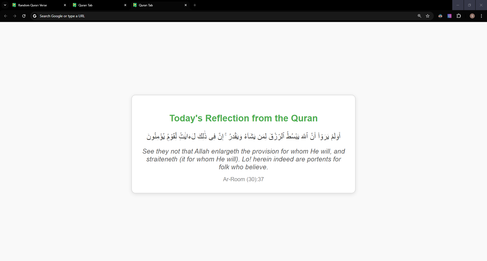
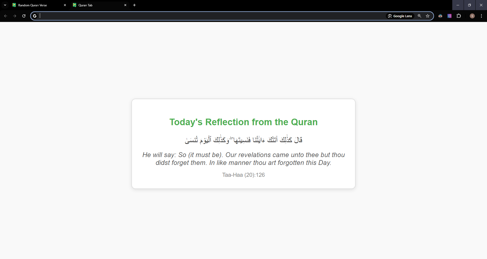

# quran-tab

## Overview
This Chrome extension displays a random verse from the Quran along with its English translation each time a new tab is opened. It aims to provide inspiration and reflection through the timeless wisdom of the Quran.

## Features
- Displays a random verse in Arabic.
- Provides the English translation from Pickthall's translation.
- Minimalistic and user-friendly design.

## Demo
Here are some screenshots of the extension in action:


*Example of a random Quran verse displayed in a new tab.*


*Another example with a different verse.*

# Installation

To use this extension, follow these steps:

1. **Clone or Download the Repository**
   ```bash
   git clone https://github.com/hafeezhmha/quran-tab.git

2. Load the Extension in Chrome
3. Open Chrome and go to
   ```bash
   chrome://extensions/.
4. Enable Developer mode by toggling the switch in the upper right corner.
5. Click on the Load unpacked button.
6. Select the folder where your extension files are located (the cloned or downloaded repository).
**The extension will now be added to Chrome.**
